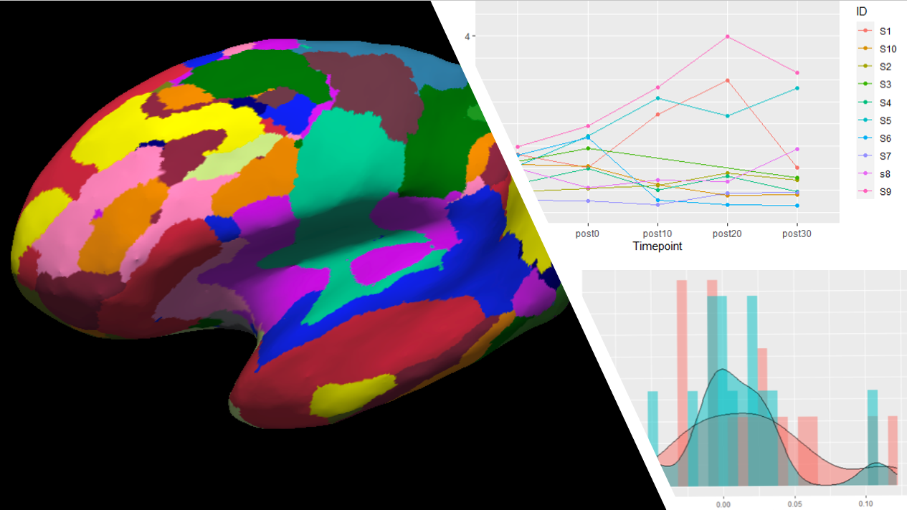

# Welcome!
My name is Benjamin Deck. I am currently a PhD student at Drexel University study Cognitive Neuroscience. Much of my work uses data science tools to understand human cognition in both health and disease. Like it says above, I am an aspiring data scientist with a soft spot for the scientific method and academia. Please check out some of my projects below. If you're interested in working together or in seeing some of my previous academic work see [my google scholar page](https://scholar.google.com/citations?user=twD1r-EAAAAJ&hl=en) or [my researchgate profile](https://www.researchgate.net/profile/Benjamin_Deck)
### Markdown

Markdown is a lightweight and easy-to-use syntax for styling your writing. It includes conventions for

```markdown
Syntax highlighted code block

# Header 1
## Header 2
### Header 3

- Bulleted
- List

1. Numbered
2. List

**Bold** and _Italic_ and `Code` text

[Link](url) and 
```

For more details see [GitHub Flavored Markdown](https://guides.github.com/features/mastering-markdown/).

### Jekyll Themes

Your Pages site will use the layout and styles from the Jekyll theme you have selected in your [repository settings](https://github.com/bdeck8317/bdeck8317.github.io/settings). The name of this theme is saved in the Jekyll `_config.yml` configuration file.

### Support or Contact

Having trouble with Pages? Check out our [documentation](https://docs.github.com/categories/github-pages-basics/) or [contact support](https://github.com/contact) and we’ll help you sort it out.
