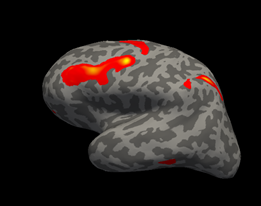
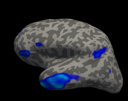

# Projects

Below you will find links to various projects. These project links will direct you to notebooks outlining some of the various projects I have worked on.

The code is freely available but at this time much of the data is not.

## Predicting Attention Deficit Hyperactivity Disorder behavior using brain activity
Here you will find my master's thesis project which uses support vector regression to predict survey responses about young adults with attention deficit hyperactivity disorder (ADHD)

 

## Predicting cognitive control behaviors in Adults using brain activity
This project uses support vector regression to predcit behaviors associated with cognitive control. Cognitive control is typically defined as the ability to shift focus and  
monitor an organisms own environment in order to attain task goals. Deficits associated with such a behavior are very common in neurological and neuropsychiatric conditions,
such as ADHD, eating disorders, substance abuse disorders, mood disorders and neurodegenerative disorders (think Parkinson's Disease/ Alzheimer's Disese).
Thus, it is important to understand how these behaviors come about via dynamic processes within the human brain. 

## Development of a novel neuroimaging biomarker to understand neuromodulation within the human motor cortex
